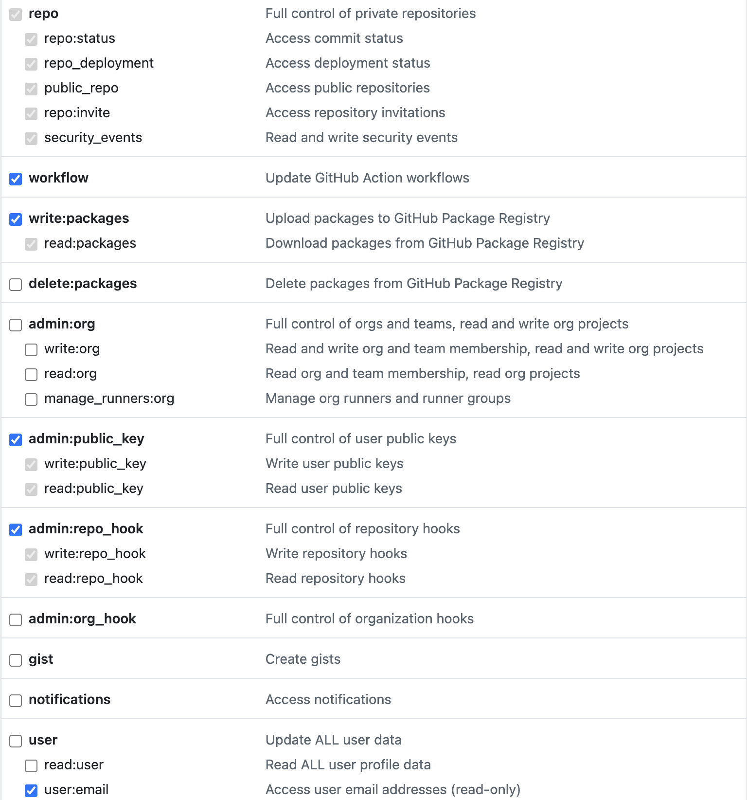

# VitePress快速搭建个人网站

[![Contributors][contributors-shield]][contributors-url]
[![Forks][forks-shield]][forks-url]
[![Stargazers][stars-shield]][stars-url]
[![Issues][issues-shield]][issues-url]

> 本文介绍VitePress搭建个人网站，并使用Docker容器化部署。

## 目录

- [安装](#安装)
- [容器化部署](#容器化部署)
- [项目托管](#项目托管)
- [网站发布](#网站发布)
- [References](#references)
- [联系作者](#联系作者)

## 安装

安装步骤概述：

1. 前置准备：宿主机安装docker、node等开发环境
2. 安装向导：基于VitePress脚手架初始化项目
3. 运行启动：打包镜像并运行容器

### 前置准备

- Node.js 18及以上版本
- Docker客户端
- 命令行终端（Windows Powershell、MacOS终端）
- 开发集成环境（IDE）: VSCode、Webstorm

（推荐VscodeProjects或WebstormProjects）创建空项目文件夹`docker-vitepress`

```shell
mkdir docker-vitepress && cd docker-vitepress
```

推荐使用pnpm安装VitePress

```shell
# 安装pnpm
npm install -g pnpm@latest
pnpm add -D vitepress
```

### 安装向导

VitePress 附带一个命令行设置向导，可以帮助你构建一个基本项目。安装后，通过运行以下命令启动向导

```shell
pnpm vitepress init
```

根据命令提示，初始化项目

```shell
┌  Welcome to VitePress!
│
◇  Where should VitePress initialize the config?
│  ./docs
│
◇  Site title:
│  My Awesome Project
│
◇  Site description:
│  A VitePress Site
│
◇  Theme:
│  Default Theme
│
◇  Use TypeScript for config and theme files?
│  Yes
│
◇  Add VitePress npm scripts to package.json?
│  Yes
│
└  Done! Now run pnpm run docs:dev and start writing.
```

安装后项，目录结构下图所示：

```shell
.
├── README.md
├── docs
│    ├── api-examples.md
│    ├── index.md
│    └── markdown-examples.md
├── node_modules
│    └── vitepress -> .pnpm/vitepress@1.3.4_@algolia+client-search@4.24.0_postcss@8.4.47_search-insights@2.17.2/node_modules/vitepress
├── package.json
└── pnpm-lock.yaml

```

### 运行启动

查看package.json下启动脚本

```json
{
  "devDependencies": {
    "vitepress": "^1.3.4"
  },
  "scripts": {
    "docs:dev": "vitepress dev docs",
    "docs:build": "vitepress build docs",
    "docs:preview": "vitepress preview docs"
  }
}
```

项目根目录启动终端，执行

```shell
pnpm run docs:dev
```

根据提示，在浏览器中打开`http://localhost:5173/`

项目停止

```shell
# MacOS
Command+C
# Windows
Ctrl+C
```

容器打包，将在`docs/.vitepress`下生成dist包，该包用于在生产环境部署

```shell
pnpm run docs:build
```

## 容器化部署

前端资源在生产环境中部署时，将源文件打包为`dist`，然后`nginx`作为Web服务器对静态资源代理。

### 容器化

项目根目录下新建`Dockerfile`

```shell
touch Dockerfile
```

粘贴如下`Dockerfile`模板，根据个人信息更改部分内容。安装`npm`和`pnpm`时默认使用腾讯云资源镜像加速，如果你在阿里云或华为云上部署该项目，若容器构建失败请更改资源镜像。

```dockerfile
FROM node:22-alpine3.20 as build-stage
# 作者信息
LABEL authors="test@test.com"

# 设置工作目录
WORKDIR /app

# 复制所有文件到工作目录
COPY . .

# 安装 pnpm Qcloud腾讯云加速
RUN npm install -g pnpm --registry=http://mirrors.cloud.tencent.com/npm/

# 安装依赖 Qcloud腾讯云加速
RUN pnpm install --registry=http://mirrors.cloud.tencent.com/npm/

# 构建生产环境下到Vue项目
RUN pnpm run docs:build

FROM nginx:alpine3.20-perl

COPY nginx.conf /etc/nginx/conf.d/default.conf

COPY --from=build-stage /app/docs/.vitepress/dist /usr/share/nginx/html

# 暴露端口
EXPOSE 8080

# 启动Nginx服务
CMD ["nginx", "-g", "daemon off;"]
```

容器构建，并将容器命名为`my-vitepress/hello:0.0.1`

```shell
docker build -t my-vitepress/hello:0.0.1 .
```

完成一个VitePress Docker容器的构建，查看镜像

```shell
docker ps | grep hello:0.0.1
```

创建并运行容器（以下两种方式任选其一）

---

docker直接运行

```shell
# 将vitepress/hello:0.0.1作为镜像启动容器，以后台方式运行，映射本地端口80，容器命名为my-vitepress
docker run -d --name vitepress-test -p 80:8080 my-vitepress/hello:0.0.1
```

停止容器

```shell
docker stop vitepress-test
```

删除容器

```shell
docker rm vitepress-test
```

---

docker-compose构建并运行，需创建`docker-compose.yaml`配置文件(可选)

```shell
# docker compose up -d 
docker-compose up -d
```

停止容器并卸载
```shell
# docker compose down
docker-compose down
```

---

在浏览器中打开 http://localhost 即可查看部署效果。

## 项目托管

> 将项目托管到GitHub，方便项目分发。任何拥有Docker环境的服务器都可以快速部署该项目。

将本项目托管到GitHub或Gitee（码云，GitHub国内版），以GitHub为例

### 注册并登录GitHub

> 过程概述，详细过程略

项目托管建议参考GitHub官方文档[Get started](https://docs.github.com/zh/get-started/start-your-journey/about-github-and-git)

1. 注册并登录：https://github.com/
2. 设置github-ssh密钥，将公钥添加到GitHub设置中密钥中
3. 创建项目仓库： `docker-vitepress`
4. 本地git仓库于GitHub仓库关联，推送本地项目

### 创建.gitignore

```shell
touch .gitignore
```

在git仓库中忽略本地IDE配置文件，以及build后生成的包

```.gitignore
docs/.vitepress/cache
docs/.vitepress/dist/
node_modules
# Jetbrains软件配置文件
.idea
```

## 网站发布*

> 无需具备公网的云服务器，GitHub以GitHub Actions和GitHub Pages的方式支持网站托管发布
> 若想在个人服务器上发布项目，使用Jenkins实现CI/CD，自动化发布，详情关注作者其他仓库项目

在GitHub中配置workflow脚本，就会自动运行。

1. 创建GitHub-Token，支持用脚本登入GitHub
2. 配置workflow配置文件`github-actions.yaml`，目录`.github/workflows/github-actions.yaml`
3. 在GitHub部署域名中添加项目名`docker-vitepress`前缀

### 创建GitHub-Token

操作步骤：

1. 登录GitHub账户
2. Settings
3. Developer settings
4. GitHub Apps -> Personal access tokens -> Tokens(classic)
5. Generate new token -> Generate new token(classic)
   1. 设置TOKEN名，Note: `MY_GITHUB_TOKEN`(自定义名称，建议全大写)
   2. 设置仓库权限：

6. 生成一串TOKEN，请妥善保管（关闭后不可查看），将在下一小节使用

### GitHub Actions-Workflow配置文件

在该项目的GitHub仓库Settings中配置仓库密钥
1. Settings
2. Security -> Secrets and variables -> Actions
3. 创建新的仓库密钥： New repository secret
4. 密钥命名为`VITE_TOKEN`，密钥为上一小节中获取的一串TOKEN

更新本项目中的`github-actions.yaml`中个性化参数

- `token`: `${{secrets.VITE_TOKEN}}`
- `git-config-name`: GitHub用户名
- `git-config-email`: GitHub用户邮箱

```yaml
# 部分内容
name: Deploy 🚀
  uses: JamesIves/github-pages-deploy-action@v4
  with:
  token: ${{secrets.VITE_TOKEN}}
  folder: docs/.vitepress/dist
  git-config-name: xiaolinstar
  git-config-email: xing.xiaolin@foxmail.com
```

`push`到GitHub仓库后，会自动触发GitHub Actions；

`workflow_dispatch`也支持点击按钮手动触发。

### 添加域名前缀

GitHub Actions部署和普通云服务器部署域名区别：
- 云服务域名：`https://vitepress-qucikstart`
- GitHub域名：`https://xiaolinstar.github.io/docker-vitepress/`
GitHub部署方式必云服务器部署多了仓库名前缀，需要在项目部署时做区分和处理，以兼容这两类部署方式。

VitePress项目的主要配置文件包括两个：
- docs/index.md
- docs/.vitepress/config.mts

只需在`config.mts`中添加2行代码即可区分项目部署方式。 修改后的`config.mts`内容如下（添加的代码以用注释标注）
```ts
import { defineConfig } from 'vitepress'

// @ts-ignore (*) 网站基础路径，区分GitHub部署和常规部署
const basePath = process.env.GITHUB_ACTIONS === 'true' ? '/docker-vitepress/' : '/'

// https://vitepress.dev/reference/site-config
export default defineConfig({
   base: basePath, // (*) 设置域名前缀
   title: "My Awesome Project",
   description: "A VitePress Site",
   themeConfig: {
      // https://vitepress.dev/reference/default-theme-config
      nav: [
         { text: 'Home', link: '/' },
         { text: 'Examples', link: '/markdown-examples' }
      ],

      sidebar: [
         {
            text: 'Examples',
            items: [
               { text: 'Markdown Examples', link: '/markdown-examples' },
               { text: 'Runtime API Examples', link: '/api-examples' }
            ]
         }
      ],

      socialLinks: [
         { icon: 'github', link: 'https://github.com/vuejs/vitepress' }
      ]
   }
})

```


## References

[1]. VitePress由Vite和Vue驱动的静态站点生成器，https://vitepress.dev/zh/

[2]. Git started，开始你的旅程，https://docs.github.com/zh/get-started/start-your-journey/about-github-and-git

[3]. GitHub Actions，https://docs.github.com/zh/actions/writing-workflows/quickstart

[4]. GitHub Pages，https://docs.github.com/zh/pages

[5]. Gitee，https://gitee.com

## 联系作者

1. 在issues中提问
2. 联系邮箱 :email: xing.xiaolin@foxmail.com

<!-- links -->

[contributors-shield]: https://img.shields.io/github/contributors/xiaolinstar/docker-vitepress.svg?style=flat-square
[contributors-url]: https://github.com/xiaolinstar/docker-vitepress/graphs/contributors
[forks-shield]: https://img.shields.io/github/forks/xiaolinstar/docker-vitepress.svg?style=flat-square
[forks-url]: https://github.com/xiaolinstar/docker-vitepress/network/members
[stars-shield]: https://img.shields.io/github/stars/xiaolinstar/docker-vitepress.svg?style=flat-square
[stars-url]: https://github.com/xiaolinstar/docker-vitepress/stargazers
[issues-shield]: https://img.shields.io/github/issues/xiaolinstar/docker-vitepress.svg?style=flat-square
[issues-url]: https://github.com/xiaolinstar/docker-vitepress/issues
