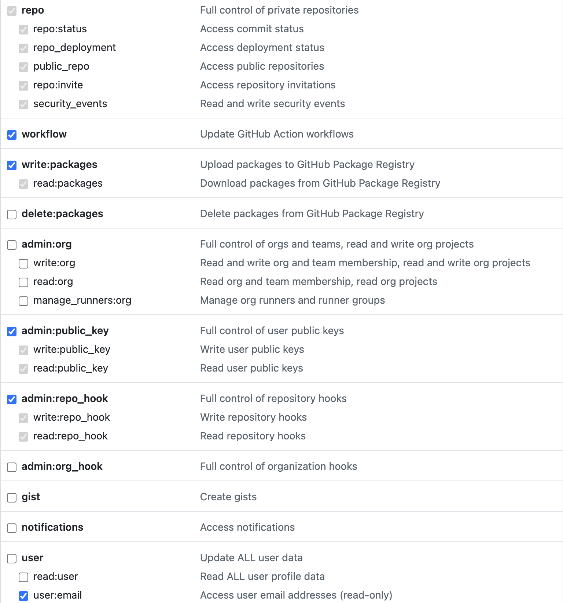

# 基于VitePress快速搭建个人网站

[![Contributors][contributors-shield]][contributors-url]
[![Forks][forks-shield]][forks-url]
[![Stargazers][stars-shield]][stars-url]
[![Issues][issues-shield]][issues-url]

> 本文介绍 VitePress 搭建个人网站，并使用 Docker 容器化部署。

## 目录

- [项目概述](#项目概述)
- [前置准备](#前置准备)
- [项目初始化](#项目初始化)
- [功能开发与测试](#功能开发与测试)
- [容器化](#容器化)
- [参考](#参考)
- [联系作者](#联系作者)

## 项目概述

1. 前置准备：宿主机安装 docker、node 等开发环境
2. 项目初始化：基于 VitePress 脚手架初始化项目
3. 🌟功能开发与测试：启动项目，开发...
4. 容器化：将项目打包为 Docker 镜像，定义 `Dockerfile` 和 `docker-compose.yaml`
5. 预发布：在本地环境使用 Docker 容器启动项目
6. 项目托管：将项目源代码推送到 GitHub（或 Gitlab Gitee）
7. 生产发布：
   - GitHub 发布：使用 GitHub Pages、GitHub Actions 免费托管项目
   - 云服务发布：云服务器（支持公网 ip 访问）发布项目

## 前置准备

软件依赖包：
- Node.js 18及以上版本
- Docker、Docker Compose
- 开发集成环境（IDE）: VSCode、WebStorm 等其一

在项目目录下（推荐 VscodeProjects 或 WebstormProjects），创建空项目文件夹 docker-vitepress

```shell
mkdir docker-vitepress && cd docker-vitepress
```
软件依赖包：
- Node.js 18及以上版本
- Docker、Docker Compose
- 开发集成环境（IDE）: VSCode、WebStorm 等其一

在项目目录下（推荐 VscodeProjects 或 WebstormProjects），创建空项目文件夹 docker-vitepress

```shell
mkdir docker-vitepress && cd docker-vitepress
```

推荐使用pnpm 启动 VitePress

```shell
# 安装pnpm
npm install -g pnpm@latest
pnpm add -D vitepress
```
推荐使用pnpm安装VitePress

```shell
# 安装pnpm
npm install -g pnpm@latest
pnpm add -D vitepress
```

## 项目初始化

VitePress 附带一个命令行设置向导，可以帮助快速构建一个初始化项目。

运行以下命令启动向导

```shell
pnpm vitepress init
```

根据命令提示，初始化项目

```shell
┌  Welcome to VitePress!
│
◇  Where should VitePress initialize the config?
│  ./docs
│
◇  Site title:
│  My Awesome Project
│
◇  Site description:
│  A VitePress Site
│
◇  Theme:
│  Default Theme
│
◇  Use TypeScript for config and theme files?
│  Yes
│
◇  Add VitePress npm scripts to package.json?
│  Yes
│
└  Done! Now run pnpm run docs:dev and start writing.
```

安装后项，项目目录结构下图所示：

```shell
.
├── README.md
├── docs
│    ├── api-examples.md
│    ├── index.md
│    └── markdown-examples.md
├── node_modules
│    └── vitepress -> .pnpm/vitepress@1.3.4_@algolia+client-search@4.24.0_postcss@8.4.47_search-insights@2.17.2/node_modules/vitepress
├── package.json
└── pnpm-lock.yaml
```

## 🌟功能开发与测试

查看 `package.json` 下启动脚本

```json
{
  "devDependencies": {
    "vitepress": "^1.3.4"
  },
  "scripts": {
    "docs:dev": "vitepress dev docs",
    "docs:build": "vitepress build docs",
    "docs:preview": "vitepress preview docs"
  }
}
```

项目根目录启动终端，执行

```shell
pnpm run docs:dev
# or
vitepress dev docs
```

根据提示，在浏览器中打开 http://localhost:5173/ ，可查看到 VitePress 默认页面。

项目停止

```shell
# MacOS
Command+C
# Windows
Ctrl+C
```

容器打包，默认在项目 `docs/.vitepress` 下生成 dist 包，该包是为静态资源，用于生产发布

```shell
pnpm run docs:build
# or
vitepress build docs
```

## 容器化

前端资源在生产环境中部署时，将源文件打包为 `dist`，然后 Nginx 作为 Web 服务器对静态资源代理。

### 构建镜像

> 创建并配置 Dockerfile，它定义了镜像打包过程

项目根目录下新建 `Dockerfile`

```shell
touch Dockerfile
```

> 如果在阿里云或华为云上构建镜像失败，请自行改资源镜像。

粘贴如下 `Dockerfile` 模板，根据个人信息更改部分内容。安装 `npm` 和 `pnpm` 时默认使用腾讯云资源镜像加速。

```dockerfile
FROM node:22-alpine3.20 AS build-stage
# 作者信息
LABEL authors="xing.xiaolin@foxmail.com"

# 设置工作目录
WORKDIR /app

# 复制所有文件到工作目录
COPY . .

# 安装 pnpm Qcloud 腾讯云加速
RUN npm install -g pnpm --registry=http://mirrors.cloud.tencent.com/npm/

# 安装依赖 Qcloud 腾讯云加速
RUN pnpm install --registry=http://mirrors.cloud.tencent.com/npm/

# 构建生产环境下到 Vue 项目
RUN pnpm run docs:build

FROM nginx:alpine3.20-perl

COPY nginx.conf /etc/nginx/conf.d/default.conf

COPY --from=build-stage /app/docs/.vitepress/dist /usr/share/nginx/html

# 暴露端口
EXPOSE 8080

# 启动Nginx服务
CMD ["nginx", "-g", "daemon off;"]
```

容器构建，并将容器命名为 `my-vitepress/vitepress-docs:0.0.1`

```shell
docker build -t my-vitepress/vitepress-docs:0.0.1 .
# buildx 构建
docker buildx build -t my-vitepress/vitepress-docs:0.0.1 .
```

完成镜像构建，检查

```shell
docker ps | grep vitepress-docs
```

### 预发布（启动容器化服务）

以下两种方式任选其一。

完成后，在浏览器中打开 http://localhost 可查看预发布效果。

#### Docker Cli 启动

在终端中执行

```shell
# 以 my-vitepress/vitepress-docs:0.0.1 为镜像启动容器
# 以后台方式运行
# 映射容器端口号 8080 到本地端口 80
# 容器命名为 hello-vitepress
docker run -d --name hello-vitepress -p 80:8080 my-vitepress/vitepress-docs:0.0.1
```

停止容器

```shell
docker stop hello-vitepress
```

删除容器

```shell
docker rm hello-vitepress
```

#### Docker Compose 启动

在项目根目录下创建 `docker-compose.yaml` 配置文件

创建并启动
```shell
docker-compose up -d
# docker compose up -d
```

停止并卸载

```shell
docker-compose down
# docker compose down
```


## 项目托管

> 将项目托管到GitHub，方便项目分发。任何拥有Docker环境的服务器都可以快速部署该项目。

将本项目托管到 GitHub 或 Gitee（码云，GitHub国内版），以 GitHub 为例

### 注册并登录GitHub

**过程概述**

项目托管建议参考GitHub官方文档[Get started](https://docs.github.com/zh/get-started/start-your-journey/about-github-and-git)

1. 注册并登录：https://github.com/
2. 设置 github-ssh 密钥 
   1. 在 `.ssh` 目录下生成非对称密钥对：id_ed25519 id_ed25519.pub
   2. 将公钥 id_ed25519.pub 添加到 GitHub 设置
3. 创建项目仓库： docker-vitepress
4. 本地 Git 仓库与 GitHub 仓库关联，推送本地项目

**核心步骤**

生成密钥对

```shell
# 1. 进入 home 目录下的 .ssh 目录，如果没有则创建
cd ~/.ssh
# 2. 创建密钥对，邮箱信息自行更改
ssh-keygen -t ed25519 -C "xing.xiaolin@foxmail.com"
```

配置 .gitignore

> .gitignore 文件的作用是定义哪些文件或文件夹应该被 Git 版本控制系统忽略，不被跟踪和提交到仓库中。

```shell
touch .gitignore
```

忽略 Git 仓库中 IDE 配置文件以及其他依赖包、目标文件，仅保留项目源代码

```.gitignore
docs/.vitepress/cache
docs/.vitepress/dist/
node_modules
# Jetbrains软件配置文件
.idea
```

## 生产发布

### GitHub Pages 发布

> 无需具备公网的云服务器，GitHub以GitHub Actions和GitHub Pages的方式支持网站托管发布
> 若想在个人服务器上发布项目，使用Jenkins实现CI/CD，自动化发布，详情关注作者其他仓库项目

在GitHub中配置workflow脚本，就会自动运行。

1. 创建GitHub-Token，支持用脚本登入GitHub
2. 配置workflow配置文件`github-actions.yaml`，目录`.github/workflows/github-actions.yaml`
3. 在GitHub部署域名中添加项目名`docker-vitepress`前缀

#### 创建GitHub-Token

操作步骤：

1. 登录GitHub账户
2. Settings
3. Developer settings
4. GitHub Apps -> Personal access tokens -> Tokens(classic)
5. Generate new token -> Generate new token(classic)
   1. 设置TOKEN名，Note: `MY_GITHUB_TOKEN`(自定义名称，建议全大写)
   2. 设置仓库权限：
      
6. 生成一串TOKEN，请妥善保管（关闭后不可查看），将在下一小节使用

#### GitHub Actions Workflow 配置文件

在该项目的GitHub仓库Settings中配置仓库密钥

1. Settings
2. Security -> Secrets and variables -> Actions
3. 创建新的仓库密钥： New repository secret
4. 密钥命名为`VITE_TOKEN`，密钥为上一小节中获取的一串TOKEN

更新本项目中的`github-actions.yaml`中个性化参数

- `token`: `${{secrets.VITE_TOKEN}}`
- `git-config-name`: GitHub用户名
- `git-config-email`: GitHub用户邮箱

```yaml
# 部分内容
name: Deploy 🚀
  uses: JamesIves/github-pages-deploy-action@v4
  with:
  token: ${{secrets.VITE_TOKEN}}
  folder: docs/.vitepress/dist
  git-config-name: xiaolinstar
  git-config-email: xing.xiaolin@foxmail.com
```

`push`到GitHub仓库后，会自动触发GitHub Actions；

`workflow_dispatch`也支持点击按钮手动触发。

#### 添加域名前缀

GitHub Actions部署和普通云服务器部署域名区别：

- 云服务域名：`https://vitepress-qucikstart`
- GitHub域名：`https://xiaolinstar.github.io/docker-vitepress/`
  GitHub部署方式必云服务器部署多了仓库名前缀，需要在项目部署时做区分和处理，以兼容这两类部署方式。

VitePress项目的主要配置文件包括两个：

- docs/index.md
- docs/.vitepress/config.mts

只需在`config.mts`中添加2行代码即可区分项目部署方式。 修改后的`config.mts`内容如下（添加的代码以用注释标注）

```ts
import { defineConfig } from 'vitepress'

// @ts-ignore (*) 网站基础路径，区分GitHub部署和常规部署
const basePath = process.env.GITHUB_ACTIONS === 'true' ? '/docker-vitepress/' : '/'

// https://vitepress.dev/reference/site-config
export default defineConfig({
   base: basePath, // (*) 设置域名前缀
   title: "My Awesome Project",
   description: "A VitePress Site",
   themeConfig: {
      // https://vitepress.dev/reference/default-theme-config
      nav: [
         { text: 'Home', link: '/' },
         { text: 'Examples', link: '/markdown-examples' }
      ],

      sidebar: [
         {
            text: 'Examples',
            items: [
               { text: 'Markdown Examples', link: '/markdown-examples' },
               { text: 'Runtime API Examples', link: '/api-examples' }
            ]
         }
      ],

      socialLinks: [
         { icon: 'github', link: 'https://github.com/vuejs/vitepress' }
      ]
   }
})

```

### 云服务器发布

略

## 参考

[1]. VitePress由Vite和Vue驱动的静态站点生成器，https://vitepress.dev/zh/

[2]. GitHub 文档，开始你的旅程，https://docs.github.com/zh/get-started/start-your-journey/about-github-and-git

[3]. GitHub Actions，https://docs.github.com/zh/actions/writing-workflows/quickstart

[4]. GitHub Pages，https://docs.github.com/zh/pages

[5]. Gitee，https://gitee.com

## 联系作者

1. 在issues中提问
2. 联系邮箱 :email: xing.xiaolin@foxmail.com

<!-- links -->

[contributors-shield]: https://img.shields.io/github/contributors/xiaolinstar/docker-vitepress.svg?style=flat-square
[contributors-url]: https://github.com/xiaolinstar/docker-vitepress/graphs/contributors
[forks-shield]: https://img.shields.io/github/forks/xiaolinstar/docker-vitepress.svg?style=flat-square
[forks-url]: https://github.com/xiaolinstar/docker-vitepress/network/members
[stars-shield]: https://img.shields.io/github/stars/xiaolinstar/docker-vitepress.svg?style=flat-square
[stars-url]: https://github.com/xiaolinstar/docker-vitepress/stargazers
[issues-shield]: https://img.shields.io/github/issues/xiaolinstar/docker-vitepress.svg?style=flat-square
[issues-url]: https://github.com/xiaolinstar/docker-vitepress/issues
